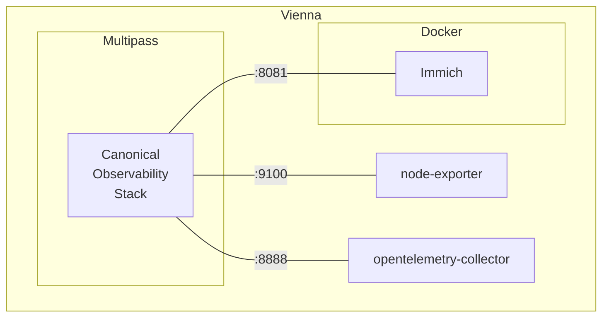

My home lab host is called `Vienna` with the following deployment:

```mermaid
graph LR

subgraph "Vienna"
    direction LR
    otelcol[opentelemetry-collector]
    ne[node-exporter]

subgraph "Docker"
    immich[Immich]
end

subgraph "Multipass"
    cos[Canonical\nObservability\nStack]
end

cos ---|:8081| immich
cos ---|:9100| ne
cos ---|:8888| otelcol

end
```
